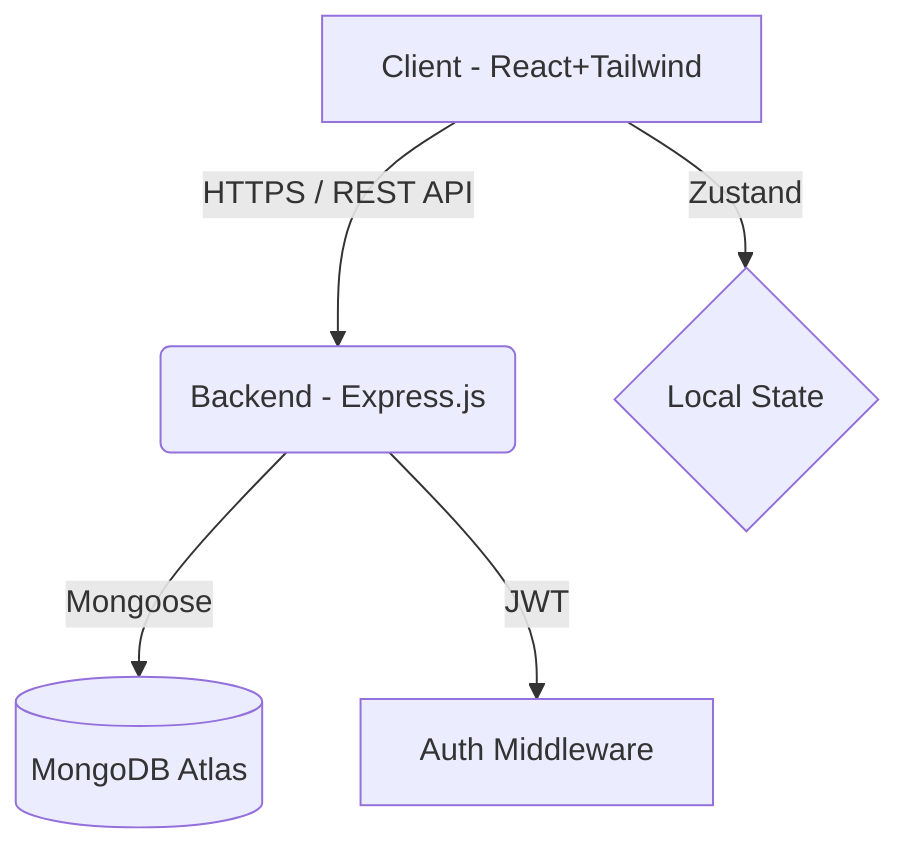

# ETHARA-AI
# AntiGravity - Startup Escape Velocity Dashboard 🚀

AntiGravity is an AI-powered dashboard designed for early-stage founders to track their metrics, predict their runway, and calculate their "Escape Velocity" (when revenue overtakes burn rate). Built to impress within a 24-hour hackathon.

## ✨ Features
- **Gravity Predictor AI:** Input metrics (MRR, Burn, Growth, Churn) to get an AI-forecasted timeline of when the startup will become profitable.
- **Beautiful Dashboard:** Dark-mode first UI using Tailwind CSS v4 and glassmorphism.
- **Data Visualization:** Interactive charts tracking monthly revenue vs expenses.
- **Secure Authentication:** JWT-based signup and login.
- **Full Stack:** React 19 Frontend + Node.js/Express Backend + MongoDB.

## 🛠 Tech Stack
- **Frontend:** React.js, Vite, Tailwind CSS v4, Zustand, Recharts, React Router
- **Backend:** Node.js, Express.js, JWT, bcrypt
- **Database:** MongoDB, Mongoose

## 🚀 Local Setup Instructions

### 1. Backend Setup
1. Open your terminal and navigate to the backend folder:
   ```bash
   cd backend
   ```
2. Install dependencies:
   ```bash
   npm install
   ```
3. Create a `.env` file in the `/backend` folder and add:
   ```env
   PORT=5000
   JWT_SECRET=your_super_secret_key
   MONGO_URI=mongodb://127.0.0.1:27017/antigravity
   ```
4. Start the server:
   ```bash
   node server.js
   ```

### 2. Frontend Setup
1. Open a new terminal and navigate to the frontend folder:
   ```bash
   cd frontend
   ```
2. Install dependencies:
   ```bash
   npm install
   ```
3. Start the development server:
   ```bash
   npm run dev
   ```
4. Visit `http://localhost:5173` in your browser.

---

## 🌍 Phase 4: Deployment Guide

To deploy this project to production, follow these steps:

### 1. MongoDB Atlas (Database)
1. Create a free cluster at [MongoDB Atlas](https://www.mongodb.com/cloud/atlas).
2. Create a database user and whitelist IP address `0.0.0.0/0`.
3. Copy the Connection String URI to use as your `MONGO_URI`.

### 2. Render or Railway (Backend)
1. Push your code to GitHub.
2. Go to Render.com or Railway.app and create a new **Web Service**.
3. Connect your GitHub repository and set the Root Directory to `backend`.
4. Set the Build Command to `npm install` and Start Command to `node server.js`.
5. Add Environment Variables: `MONGO_URI` (from Atlas) and `JWT_SECRET`.
6. Deploy and copy the backend live URL.

### 3. Vercel (Frontend)
1. In your frontend, update any API calls (e.g., using Axios or Fetch) to point to your new Render Backend URL instead of `localhost:5000`.
2. Go to [Vercel](https://vercel.com) and create a new project.
3. Connect your GitHub repository and set the Root Directory to `frontend`.
4. Vercel will automatically detect Vite and configure the build settings.
5. Click **Deploy**.

---

## 📝 Phase 5: Submission Materials

### Project Architecture Diagram


### 1-Minute Demo Script
*"Hi everyone, we built AntiGravity. As founders, we know the stress of tracking burn rate and runway across scattered spreadsheets. AntiGravity centralizes this. Let me show you the dashboard. Here we see our MRR and Active Users in real-time. But the magic is our Gravity Predictor. I plug in our 15% growth rate and 5% churn, and AntiGravity predicts our exact Escape Velocity—the month we become profitable—along with actionable AI insights on how to get there faster. Built with React, Node, and MongoDB. Thank you for your time."*

### Resume-Worthy Bullet Points
- **Architected and developed a full-stack SaaS dashboard** ("AntiGravity") within 24 hours using React 19, Node.js, Express, and MongoDB, enabling founders to track critical financial metrics.
- **Engineered an AI forecasting algorithm** ("Gravity Predictor") to calculate startup runway and profitability timelines based on dynamic user inputs, providing actionable growth insights.
- **Designed a responsive, dark-theme UI** utilizing Tailwind CSS v4 and Recharts to visualize complex financial data seamlessly.
- **Implemented secure JWT authentication** and RESTful APIs, utilizing Zustand for efficient client-side state management.
-
1. Backend (backend/server.js)
javascript
require('dotenv').config();
const express = require('express');
const mongoose = require('mongoose');
const cors = require('cors');
const bcrypt = require('bcrypt');
const jwt = require('jsonwebtoken');
const User = require('./models/User');
const Log = require('./models/Log');
const app = express();
app.use(express.json());
app.use(cors());
const PORT = process.env.PORT || 5000;
const JWT_SECRET = process.env.JWT_SECRET || 'hackathon_secret_key_123';
const MONGO_URI = process.env.MONGO_URI || 'mongodb://127.0.0.1:27017/antigravity';
// Connect to MongoDB
mongoose.connect(MONGO_URI)
  .then(() => console.log('MongoDB Connected'))
  .catch(err => console.log('MongoDB Connection Error:', err));
// --- Middleware ---
const authMiddleware = (req, res, next) => {
  const token = req.header('Authorization')?.replace('Bearer ', '');
  if (!token) return res.status(401).json({ error: 'Access denied' });
  try {
    const verified = jwt.verify(token, JWT_SECRET);
    req.user = verified;
    next();
  } catch (err) {
    res.status(400).json({ error: 'Invalid token' });
  }
};
// --- Auth APIs ---
app.post('/api/auth/signup', async (req, res) => {
  try {
    const { name, email, password } = req.body;
    const salt = await bcrypt.genSalt(10);
    const hashedPassword = await bcrypt.hash(password, salt);
    
    const newUser = new User({ name, email, password: hashedPassword });
    await newUser.save();
    
    const token = jwt.sign({ id: newUser._id }, JWT_SECRET, { expiresIn: '1d' });
    res.status(201).json({ token, user: { id: newUser._id, name, email } });
  } catch (error) {
    res.status(400).json({ error: error.message });
  }
});
app.post('/api/auth/login', async (req, res) => {
  try {
    const { email, password } = req.body;
    const user = await User.findOne({ email });
    if (!user) return res.status(400).json({ error: 'User not found' });
    const validPass = await bcrypt.compare(password, user.password);
    if (!validPass) return res.status(400).json({ error: 'Invalid password' });
    const token = jwt.sign({ id: user._id }, JWT_SECRET, { expiresIn: '1d' });
    res.json({ token, user: { id: user._id, name: user.name, email } });
  } catch (error) {
    res.status(500).json({ error: error.message });
  }
});
// --- Logs CRUD APIs ---
app.get('/api/logs', authMiddleware, async (req, res) => {
  try {
    const logs = await Log.find({ userId: req.user.id }).sort({ createdAt: 1 });
    res.json(logs);
  } catch (error) {
    res.status(500).json({ error: error.message });
  }
});
app.post('/api/logs', authMiddleware, async (req, res) => {
  try {
    const newLog = new Log({ ...req.body, userId: req.user.id });
    await newLog.save();
    res.status(201).json(newLog);
  } catch (error) {
    res.status(400).json({ error: error.message });
  }
});
// --- AI Predictor Mock API ---
app.post('/api/predict', authMiddleware, async (req, res) => {
  const { mrr, burn, growth, churn } = req.body;
  setTimeout(() => {
    const netGrowth = growth - churn;
    res.json({
      escapeVelocity: netGrowth > 0 ? `${Math.ceil(burn / (mrr * (netGrowth/100)))} Months` : 'Risk',
      insights: [
        `Net growth is ${netGrowth}%`,
        `Focus on reducing churn by 2%`
      ]
    });
  }, 1000);
});
app.listen(PORT, () => console.log(`Backend Server running on port ${PORT}`));
2. Backend Models (backend/models/User.js & backend/models/Log.js)
User.js

javascript
const mongoose = require('mongoose');
const UserSchema = new mongoose.Schema({
  name: { type: String, required: true },
  email: { type: String, required: true, unique: true },
  password: { type: String, required: true },
  createdAt: { type: Date, default: Date.now }
});
module.exports = mongoose.model('User', UserSchema);
Log.js

javascript
const mongoose = require('mongoose');
const LogSchema = new mongoose.Schema({
  userId: { type: mongoose.Schema.Types.ObjectId, ref: 'User', required: true },
  month: { type: String, required: true },
  revenue: { type: Number, required: true },
  expenses: { type: Number, required: true },
  createdAt: { type: Date, default: Date.now }
});
module.exports = mongoose.model('Log', LogSchema);
3. Frontend App & Router (frontend/src/App.jsx)
jsx
import React from 'react';
import { BrowserRouter, Routes, Route, Navigate } from 'react-router-dom';
import DashboardLayout from './layouts/DashboardLayout';
import Dashboard from './pages/Dashboard';
import GravityPredictor from './pages/GravityPredictor';
import Login from './pages/Login';
import Logs from './pages/Logs';
import { useStore } from './store/useStore';
const ProtectedRoute = ({ children }) => {
  const { user } = useStore();
  if (!user) return <Navigate to="/login" replace />;
  return children;
};
export default function App() {
  return (
    <BrowserRouter>
      <Routes>
        <Route path="/login" element={<Login />} />
        <Route path="/" element={<ProtectedRoute><DashboardLayout /></ProtectedRoute>}>
          <Route index element={<Dashboard />} />
          <Route path="predictor" element={<GravityPredictor />} />
          <Route path="logs" element={<Logs />} />
        </Route>
      </Routes>
    </BrowserRouter>
  );
}
4. Frontend State Management (frontend/src/store/useStore.js)
javascript
import { create } from 'zustand';
export const useStore = create((set) => ({
  user: null,
  login: (userData) => set({ user: userData }),
  logout: () => set({ user: null }),
  
  metrics: {
    mrr: 12500,
    burnRate: 8200,
    activeUsers: 1420,
    runway: 14
  },
  
  logs: [
    { id: 1, month: 'Jan', revenue: 9000, expenses: 8000 },
    { id: 2, month: 'Feb', revenue: 10500, expenses: 8100 },
    { id: 3, month: 'Mar', revenue: 11200, expenses: 8300 },
    { id: 4, month: 'Apr', revenue: 12500, expenses: 8200 },
  ],
}));
5. Frontend Layout (frontend/src/layouts/DashboardLayout.jsx)
jsx
import React from 'react';
import { NavLink, Outlet, useNavigate } from 'react-router-dom';
import { LayoutDashboard, Rocket, LogOut, BarChart3 } from 'lucide-react';
import { useStore } from '../store/useStore';
export default function DashboardLayout() {
  const { user, logout } = useStore();
  const navigate = useNavigate();
  const handleLogout = () => {
    logout(); navigate('/login');
  };
  return (
    <div className="flex h-screen bg-slate-900 text-slate-50 font-sans">
      <aside className="w-64 bg-slate-800 border-r border-slate-700 flex flex-col">
        <div className="p-6 flex items-center gap-3">
          <div className="bg-indigo-500 p-2 rounded-lg"><Rocket className="w-6 h-6 text-white" /></div>
          <span className="text-xl font-bold tracking-wider">AntiGravity</span>
        </div>
        <nav className="flex-1 px-4 py-6 space-y-2">
          <NavLink to="/" className={({ isActive }) => `flex items-center gap-3 px-4 py-3 rounded-xl ${isActive ? 'bg-indigo-500/10 text-indigo-400' : 'text-slate-400'}`}><LayoutDashboard className="w-5 h-5" /> <span>Dashboard</span></NavLink>
          <NavLink to="/predictor" className={({ isActive }) => `flex items-center gap-3 px-4 py-3 rounded-xl ${isActive ? 'bg-indigo-500/10 text-indigo-400' : 'text-slate-400'}`}><Rocket className="w-5 h-5" /> <span>Predictor</span></NavLink>
        </nav>
        <div className="p-4 border-t border-slate-700">
          <button onClick={handleLogout} className="flex items-center gap-3 px-4 py-3 w-full rounded-xl text-slate-400 hover:text-rose-400"><LogOut className="w-5 h-5" /> <span>Logout</span></button>
        </div>
      </aside>
      <main className="flex-1 flex flex-col overflow-hidden">
        <header className="h-20 border-b border-slate-700 bg-slate-800/50 flex items-center justify-between px-8 backdrop-blur-md">
          <h2 className="text-xl font-semibold">Welcome back, {user?.name || 'Founder'}</h2>
        </header>
        <div className="flex-1 overflow-y-auto p-8"><Outlet /></div>
      </main>
    </div>
  );
}
6. Dashboard Page (frontend/src/pages/Dashboard.jsx)
jsx
import React from 'react';
import { useStore } from '../store/useStore';
import { AreaChart, Area, XAxis, YAxis, CartesianGrid, Tooltip, ResponsiveContainer } from 'recharts';
export default function Dashboard() {
  const { metrics, logs } = useStore();
  return (
    <div className="space-y-8">
      <h1 className="text-3xl font-bold text-white mb-2">Metrics Overview</h1>
      
      <div className="grid grid-cols-4 gap-6">
        <div className="bg-slate-800 rounded-2xl p-6 border border-slate-700/50">
          <h3 className="text-slate-400 text-sm">MRR</h3>
          <p className="text-3xl font-bold text-white">${metrics.mrr}</p>
        </div>
        <div className="bg-slate-800 rounded-2xl p-6 border border-slate-700/50">
          <h3 className="text-slate-400 text-sm">Burn Rate</h3>
          <p className="text-3xl font-bold text-white">${metrics.burnRate}</p>
        </div>
      </div>
      <div className="bg-slate-800 rounded-2xl p-6 h-80 w-full border border-slate-700/50">
        <h3 className="text-lg font-semibold text-white mb-6">Revenue vs Expenses</h3>
        <ResponsiveContainer width="100%" height="100%">
          <AreaChart data={logs}>
            <XAxis dataKey="month" stroke="#94a3b8" />
            <YAxis stroke="#94a3b8" />
            <CartesianGrid strokeDasharray="3 3" stroke="#334155" />
            <Tooltip contentStyle={{ backgroundColor: '#1e293b', borderColor: '#334155', color: '#f8fafc' }} />
            <Area type="monotone" dataKey="revenue" stroke="#10b981" fill="#10b981" fillOpacity={0.3} />
            <Area type="monotone" dataKey="expenses" stroke="#f43f5e" fill="#f43f5e" fillOpacity={0.3} />
          </AreaChart>
        </ResponsiveContainer>
      </div>
    </div>
  );
}
7. Gravity Predictor (frontend/src/pages/GravityPredictor.jsx)
jsx
import React, { useState } from 'react';
import { useStore } from '../store/useStore';
export default function GravityPredictor() {
  const { metrics } = useStore();
  const [form, setForm] = useState({ mrr: metrics.mrr, burn: metrics.burnRate, growth: 15, churn: 5 });
  const [result, setResult] = useState(null);
  const handlePredict = (e) => {
    e.preventDefault();
    const netGrowth = form.growth - form.churn;
    let currentMrr = Number(form.mrr);
    let months = 0;
    if (currentMrr >= form.burn) months = 0;
    else if (netGrowth <= 0) months = -1;
    else {
      while (currentMrr < form.burn && months < 60) {
        currentMrr += currentMrr * (netGrowth / 100);
        months++;
      }
    }
    
    setResult({
      escapeVelocity: months === 0 ? 'Achieved!' : months === -1 ? 'Critical Risk' : `${months} Months`,
      insights: [`Net growth is ${netGrowth}%`, `Reduce churn to accelerate profitability.`]
    });
  };
  return (
    <div className="max-w-4xl mx-auto space-y-8">
      <h1 className="text-3xl font-bold text-white">Gravity Predictor AI</h1>
      <div className="grid grid-cols-2 gap-8">
        <form onSubmit={handlePredict} className="bg-slate-800 p-8 rounded-3xl space-y-6">
          <input type="number" value={form.mrr} onChange={e => setForm({...form, mrr: e.target.value})} className="w-full bg-slate-900 border border-slate-700 rounded-xl px-4 py-3 text-white" placeholder="MRR" />
          <input type="number" value={form.burn} onChange={e => setForm({...form, burn: e.target.value})} className="w-full bg-slate-900 border border-slate-700 rounded-xl px-4 py-3 text-white" placeholder="Burn Rate" />
          <input type="number" value={form.growth} onChange={e => setForm({...form, growth: e.target.value})} className="w-full bg-slate-900 border border-slate-700 rounded-xl px-4 py-3 text-white" placeholder="Growth %" />
          <input type="number" value={form.churn} onChange={e => setForm({...form, churn: e.target.value})} className="w-full bg-slate-900 border border-slate-700 rounded-xl px-4 py-3 text-white" placeholder="Churn %" />
          <button type="submit" className="w-full bg-indigo-600 text-white font-semibold py-4 rounded-xl">Calculate Escape Velocity</button>
        </form>
        <div className="p-8 rounded-3xl border border-indigo-500/50 bg-slate-800">
          {result ? (
            <div className="space-y-6 text-center">
              <p className="text-slate-400">Predicted Escape Velocity</p>
              <div className="text-5xl font-extrabold text-indigo-400">{result.escapeVelocity}</div>
              <ul className="text-left text-slate-300 mt-6">
                {result.insights.map((insight, idx) => <li key={idx} className="p-3 bg-slate-900/50 rounded-xl mb-2">{insight}</li>)}
              </ul>
            </div>
          ) : <p className="text-slate-500 text-center">Enter your metrics to see AI insights.</p>}
        </div>
      </div>
    </div>
  );
}
8. Global CSS (frontend/src/index.css)
css
@import "tailwindcss";
@theme {
  --color-slate-900: #0f172a;
  --color-slate-800: #1e293b;
  --color-slate-400: #94a3b8;
  --color-slate-50: #f8fafc;
  --color-indigo-500: #6366f1;
  --color-emerald-500: #10b981;
  --color-rose-500: #f43f5e;
}
body {
  @apply bg-slate-900 text-slate-50 font-sans;
  margin: 0;
  padding: 0;
}
