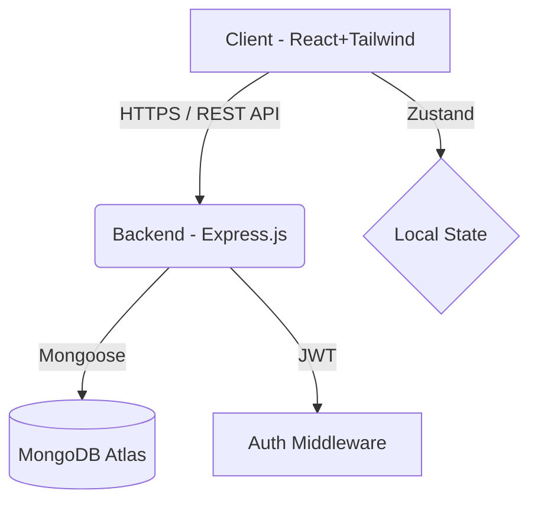

# ETHARA-AI
# AntiGravity - Startup Escape Velocity Dashboard 🚀

AntiGravity is an AI-powered dashboard designed for early-stage founders to track their metrics, predict their runway, and calculate their "Escape Velocity" (when revenue overtakes burn rate). Built to impress within a 24-hour hackathon.

## ✨ Features
- **Gravity Predictor AI:** Input metrics (MRR, Burn, Growth, Churn) to get an AI-forecasted timeline of when the startup will become profitable.
- **Beautiful Dashboard:** Dark-mode first UI using Tailwind CSS v4 and glassmorphism.
- **Data Visualization:** Interactive charts tracking monthly revenue vs expenses.
- **Secure Authentication:** JWT-based signup and login.
- **Full Stack:** React 19 Frontend + Node.js/Express Backend + MongoDB.

## 🛠 Tech Stack
- **Frontend:** React.js, Vite, Tailwind CSS v4, Zustand, Recharts, React Router
- **Backend:** Node.js, Express.js, JWT, bcrypt
- **Database:** MongoDB, Mongoose

## 🚀 Local Setup Instructions

### 1. Backend Setup
1. Open your terminal and navigate to the backend folder:
   ```bash
   cd backend
   ```
2. Install dependencies:
   ```bash
   npm install
   ```
3. Create a `.env` file in the `/backend` folder and add:
   ```env
   PORT=5000
   JWT_SECRET=your_super_secret_key
   MONGO_URI=mongodb://127.0.0.1:27017/antigravity
   ```
4. Start the server:
   ```bash
   node server.js
   ```

### 2. Frontend Setup
1. Open a new terminal and navigate to the frontend folder:
   ```bash
   cd frontend
   ```
2. Install dependencies:
   ```bash
   npm install
   ```
3. Start the development server:
   ```bash
   npm run dev
   ```
4. Visit `http://localhost:5173` in your browser.

---

## 🌍 Phase 4: Deployment Guide

To deploy this project to production, follow these steps:

### 1. MongoDB Atlas (Database)
1. Create a free cluster at [MongoDB Atlas](https://www.mongodb.com/cloud/atlas).
2. Create a database user and whitelist IP address `0.0.0.0/0`.
3. Copy the Connection String URI to use as your `MONGO_URI`.

### 2. Render or Railway (Backend)
1. Push your code to GitHub.
2. Go to Render.com or Railway.app and create a new **Web Service**.
3. Connect your GitHub repository and set the Root Directory to `backend`.
4. Set the Build Command to `npm install` and Start Command to `node server.js`.
5. Add Environment Variables: `MONGO_URI` (from Atlas) and `JWT_SECRET`.
6. Deploy and copy the backend live URL.

### 3. Vercel (Frontend)
1. In your frontend, update any API calls (e.g., using Axios or Fetch) to point to your new Render Backend URL instead of `localhost:5000`.
2. Go to [Vercel](https://vercel.com) and create a new project.
3. Connect your GitHub repository and set the Root Directory to `frontend`.
4. Vercel will automatically detect Vite and configure the build settings.
5. Click **Deploy**.

---

## 📝 Phase 5: Submission Materials

### Project Architecture Diagram


### 1-Minute Demo Script
*"Hi everyone, we built AntiGravity. As founders, we know the stress of tracking burn rate and runway across scattered spreadsheets. AntiGravity centralizes this. Let me show you the dashboard. Here we see our MRR and Active Users in real-time. But the magic is our Gravity Predictor. I plug in our 15% growth rate and 5% churn, and AntiGravity predicts our exact Escape Velocity—the month we become profitable—along with actionable AI insights on how to get there faster. Built with React, Node, and MongoDB. Thank you for your time."*

### Resume-Worthy Bullet Points
- **Architected and developed a full-stack SaaS dashboard** ("AntiGravity") within 24 hours using React 19, Node.js, Express, and MongoDB, enabling founders to track critical financial metrics.
- **Engineered an AI forecasting algorithm** ("Gravity Predictor") to calculate startup runway and profitability timelines based on dynamic user inputs, providing actionable growth insights.
- **Designed a responsive, dark-theme UI** utilizing Tailwind CSS v4 and Recharts to visualize complex financial data seamlessly.
- **Implemented secure JWT authentication** and RESTful APIs, utilizing Zustand for efficient client-side state management.
-
